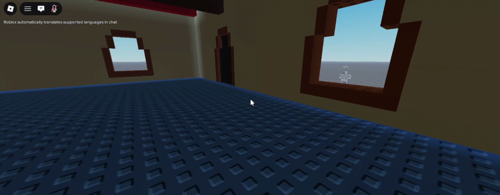

# Roblox NPC Command Interpreter

An AI-driven Roblox NPC that translates natural-language chat instructions into a sequence of executed in-game actions (including resolving mid-instruction corrections into a single coherent plan.)

## Example

> "Go into the house, then pick up the medieval item. After that, close the door behind you, come to me, and then drop the sword (actually.. don't close the door behind you)"

The NPC doesn't just react to keywords, the instruction goes to an LLM which has to hold the whole sentence in context, recognize that the second half revises the first, and output a single final plan rather than acting on every clause literally.

## How it works

1. **Player chats** in Roblox's normal chat box — no custom UI needed.
2. **The message goes to an LLM call** via Roblox's native `TextGenerator` class, seeded with a system prompt that defines a small, fixed action vocabulary (`move_to`, `open`, `close`, `pickup`, `drop`) and the known objects in the scene.
3. **The raw response is parsed defensively.** The model doesn't always return clean JSON, sometimes it prepends an AI-generated-content disclaimer despite explicit instructions not to. Rather than trusting the format, the script extracts just the `[...]` array from the response before parsing.
4. **The plan executes** as an ordered loop of actions against named objects in the scene.
5. **The world updates** — the NPC walks, the door opens, items get picked up or dropped.

## Why constrain the output like this

The LLM's only job is the hard part: turning messy natural language into intent. It doesn't touch the game world directly, it outputs a plan from a small fixed vocabulary, and deterministic Luau code does the actual execution. That split keeps the unpredictable part (the LLM) contained, and the risky part (manipulating game state) fully controlled and testable.

## Setup

1. Open the project in Roblox Studio.
2. Add three `Part`s to `Workspace` named `WoodenDoor`, `Sword`, and `Trophy`, plus an NPC model named `NPC` with a `Humanoid`.
3. Enable **Allow HTTP Requests** in Game Settings → Security (only needed if using an external LLM API instead of Roblox's native one).
4. Place `NPCController.server.lua` in `ServerScriptService`.
5. Press Play, type an instruction in chat, and watch the Output window for the raw LLM response and executed plan.

## What I'd build next

- Add pathfinding for move_to commands.
- Expand the action vocabulary beyond the current 5 actions.
- Handle ambiguous references when multiple similar objects exist in a scene.
- Add a lightweight retry/self-correction step for malformed model output instead of just rejecting it.
- Add VR support ("Go over to where I'm point my hand to").

## License

MIT. See [LICENSE](./LICENSE).
